Visualization
================
Ying Jin
2020/10/1

``` r
library(tidyverse)
```

    ## -- Attaching packages --------------- tidyverse 1.3.0 --

    ## √ ggplot2 3.3.2     √ purrr   0.3.4
    ## √ tibble  3.0.3     √ dplyr   1.0.2
    ## √ tidyr   1.1.2     √ stringr 1.4.0
    ## √ readr   1.3.1     √ forcats 0.5.0

    ## -- Conflicts ------------------ tidyverse_conflicts() --
    ## x dplyr::filter() masks stats::filter()
    ## x dplyr::lag()    masks stats::lag()

``` r
library(ggridges)
```

## Load the weather data

``` r
weather_df = 
  rnoaa::meteo_pull_monitors(
    c("USW00094728", "USC00519397", "USS0023B17S"),
    var = c("PRCP", "TMIN", "TMAX"), 
    date_min = "2017-01-01",
    date_max = "2017-12-31") %>%
  mutate(
    name = recode(
      id, 
      USW00094728 = "CentralPark_NY", 
      USC00519397 = "Waikiki_HA",
      USS0023B17S = "Waterhole_WA"),
    tmin = tmin / 10,
    tmax = tmax / 10) %>%
  select(name, id, everything())
```

    ## Registered S3 method overwritten by 'hoardr':
    ##   method           from
    ##   print.cache_info httr

    ## using cached file: C:\Users\jinyc\AppData\Local\cache/R/noaa_ghcnd/USW00094728.dly

    ## date created (size, mb): 2020-10-01 23:25:20 (7.534)

    ## file min/max dates: 1869-01-01 / 2020-09-30

    ## using cached file: C:\Users\jinyc\AppData\Local\cache/R/noaa_ghcnd/USC00519397.dly

    ## date created (size, mb): 2020-10-01 23:28:19 (1.703)

    ## file min/max dates: 1965-01-01 / 2020-03-31

    ## using cached file: C:\Users\jinyc\AppData\Local\cache/R/noaa_ghcnd/USS0023B17S.dly

    ## date created (size, mb): 2020-10-01 22:54:34 (0.879)

    ## file min/max dates: 1999-09-01 / 2020-09-30

## Scatter plots

Create my first scatter plot ever.

``` r
ggplot(weather_df,aes(x = tmin, y = tmax)) + 
  geom_point()
```

    ## Warning: Removed 15 rows containing missing values (geom_point).

<!-- -->

New approach, same plot.

``` r
weather_df %>% 
  ggplot(aes (x = tmin, y = tmax)) +
  geom_point()
```

    ## Warning: Removed 15 rows containing missing values (geom_point).

<!-- -->

Save and edit a plot object.

``` r
weather_plot =
  weather_df %>% 
  ggplot(aes(x = tmin,y = tmax))

weather_plot + geom_point()
```

    ## Warning: Removed 15 rows containing missing values (geom_point).

<!-- -->

## Avcanced scatter plot

Start with the same one and make it fancy.

``` r
weather_df %>% 
  ggplot(aes (x = tmin, y = tmax,color = name)) +
  geom_point() + 
  geom_smooth(se = FALSE)
```

    ## `geom_smooth()` using method = 'loess' and formula 'y ~ x'

    ## Warning: Removed 15 rows containing non-finite values (stat_smooth).

    ## Warning: Removed 15 rows containing missing values (geom_point).

<!-- -->

What about the `aes` placement …?

``` r
weather_df %>% 
  ggplot(aes (x = tmin, y = tmax)) +
  geom_point(aes(color = name)) +
  geom_smooth()
```

    ## `geom_smooth()` using method = 'gam' and formula 'y ~ s(x, bs = "cs")'

    ## Warning: Removed 15 rows containing non-finite values (stat_smooth).

    ## Warning: Removed 15 rows containing missing values (geom_point).

<!-- -->

Let’s facet somethings\!\!\!

``` r
weather_df %>% 
  ggplot(aes(x = tmin, y = tmax,color = name)) +
  geom_point(alpha = .2,size = .3) + 
  geom_smooth(se = FALSE) +
  facet_grid(.~name)
```

    ## `geom_smooth()` using method = 'loess' and formula 'y ~ x'

    ## Warning: Removed 15 rows containing non-finite values (stat_smooth).

    ## Warning: Removed 15 rows containing missing values (geom_point).

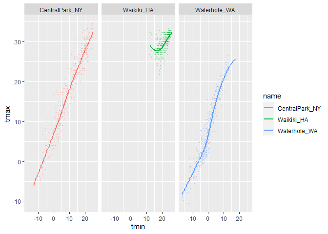<!-- -->

``` r
weather_df %>% 
  ggplot(aes (x = tmin, y = tmax,alpha = tmin,color = name)) +
  geom_point() + 
  geom_smooth(se = FALSE) +
  facet_grid(.~ name)
```

    ## `geom_smooth()` using method = 'loess' and formula 'y ~ x'

    ## Warning: Removed 15 rows containing non-finite values (stat_smooth).

    ## Warning: Removed 15 rows containing missing values (geom_point).

<!-- -->

Let’s combine some elements abd try a new plot.

``` r
weather_df %>% 
  ggplot(aes(x = date, y = tmax,color = name)) +
  geom_point(aes(size = prcp),alpha = .5) +
  geom_smooth(se = FALSE) +
  facet_grid(.~name)
```

    ## `geom_smooth()` using method = 'loess' and formula 'y ~ x'

    ## Warning: Removed 3 rows containing non-finite values (stat_smooth).

    ## Warning: Removed 3 rows containing missing values (geom_point).

<!-- -->

## Some small notes

How many geom have to exist?

You can have whatever geoms you want.

``` r
weather_df %>% 
  ggplot(aes(x = tmin, y = tmax,color = name)) +
  geom_point()
```

    ## Warning: Removed 15 rows containing missing values (geom_point).

<!-- -->

``` r
  geom_smooth(se = FALSE)
```

    ## geom_smooth: na.rm = FALSE, orientation = NA, se = FALSE
    ## stat_smooth: na.rm = FALSE, orientation = NA, se = FALSE
    ## position_identity

You can use a neat geom\!

``` r
weather_df %>% 
ggplot(aes(x = tmax, y = tmin)) +
geom_bin2d()
```

    ## Warning: Removed 15 rows containing non-finite values (stat_bin2d).

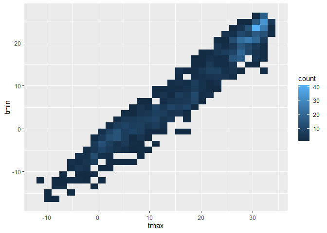<!-- -->

``` r
weather_df %>% 
ggplot(aes(x = tmax, y = tmin)) +
geom_density2d() +
  geom_point(alpha = .3)
```

    ## Warning: Removed 15 rows containing non-finite values (stat_density2d).

    ## Warning: Removed 15 rows containing missing values (geom_point).

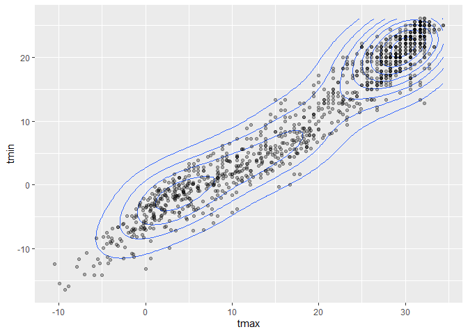<!-- -->

## Univariate plots

Histograms are really great.

``` r
weather_df %>% 
  ggplot(aes(x = tmin)) +
  geom_histogram()
```

    ## `stat_bin()` using `bins = 30`. Pick better value with `binwidth`.

    ## Warning: Removed 15 rows containing non-finite values (stat_bin).

<!-- -->

Can we add color…

``` r
weather_df %>% 
  ggplot(aes(x = tmin,fill = name)) +
  geom_histogram(position = "dodge")
```

    ## `stat_bin()` using `bins = 30`. Pick better value with `binwidth`.

    ## Warning: Removed 15 rows containing non-finite values (stat_bin).

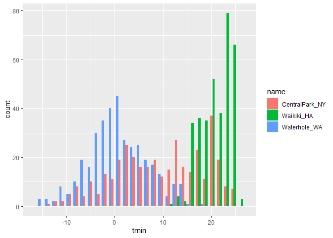<!-- -->

``` r
weather_df %>% 
  ggplot(aes(x = tmin)) +
  geom_histogram() +
  facet_grid(.~name)
```

    ## `stat_bin()` using `bins = 30`. Pick better value with `binwidth`.

    ## Warning: Removed 15 rows containing non-finite values (stat_bin).

<!-- -->

Let’s try a new geometry\!

``` r
weather_df %>% 
  ggplot(aes(x= tmin,fill = name)) +
  geom_density(alpha = .3)
```

    ## Warning: Removed 15 rows containing non-finite values (stat_density).

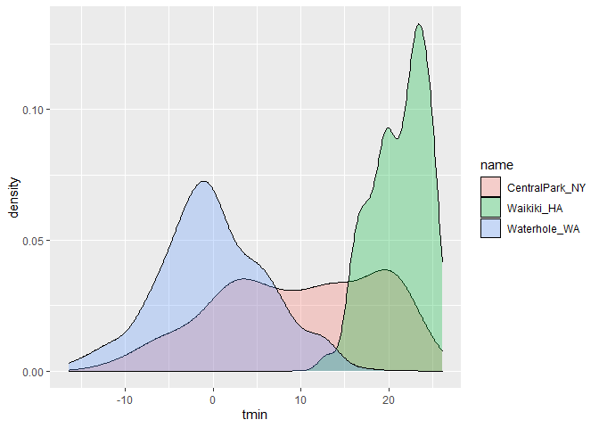<!-- -->

What about boxplots?

``` r
weather_df %>% 
  ggplot(aes(x = name, y = tmin)) +
  geom_boxplot()
```

    ## Warning: Removed 15 rows containing non-finite values (stat_boxplot).

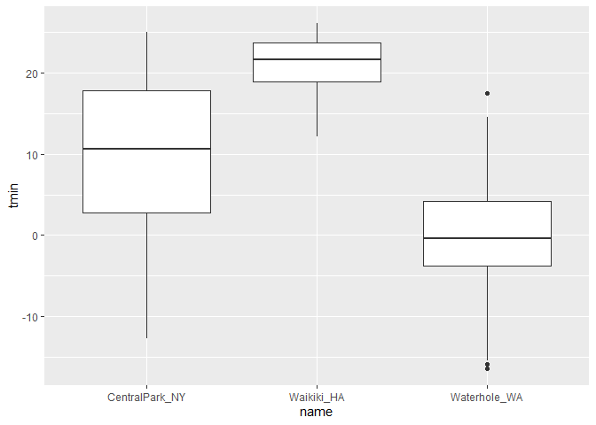<!-- -->

Trendy plots

``` r
weather_df  %>% 
  ggplot(aes(x = name, y = tmin, fill = name)) + 
  geom_violin(alpha = .5) +
  stat_summary(fun = "median")
```

    ## Warning: Removed 15 rows containing non-finite values (stat_ydensity).

    ## Warning: Removed 15 rows containing non-finite values (stat_summary).

    ## Warning: Removed 3 rows containing missing values (geom_segment).

<!-- -->

Ridge plots – the most popular plot of 2017

``` r
weather_df %>% 
  ggplot(aes(x = tmin, y = name)) +
  geom_density_ridges()
```

    ## Picking joint bandwidth of 1.67

    ## Warning: Removed 15 rows containing non-finite values (stat_density_ridges).

<!-- -->

## Save and Embed

Let’s save the scatter plot.

``` r
weather_plot <- 
  weather_df %>% 
  ggplot(aes(x = tmin, y = tmax, color = name)) +
  geom_point(alpha = .5)

ggsave("./results/weather_plot.pdf",weather_plot,width = 8, height = 5)
```

    ## Warning: Removed 15 rows containing missing values (geom_point).

hat about embeding…

``` r
weather_plot
```

    ## Warning: Removed 15 rows containing missing values (geom_point).

<!-- -->

Embed at different size.

``` r
weather_plot
```

    ## Warning: Removed 15 rows containing missing values (geom_point).

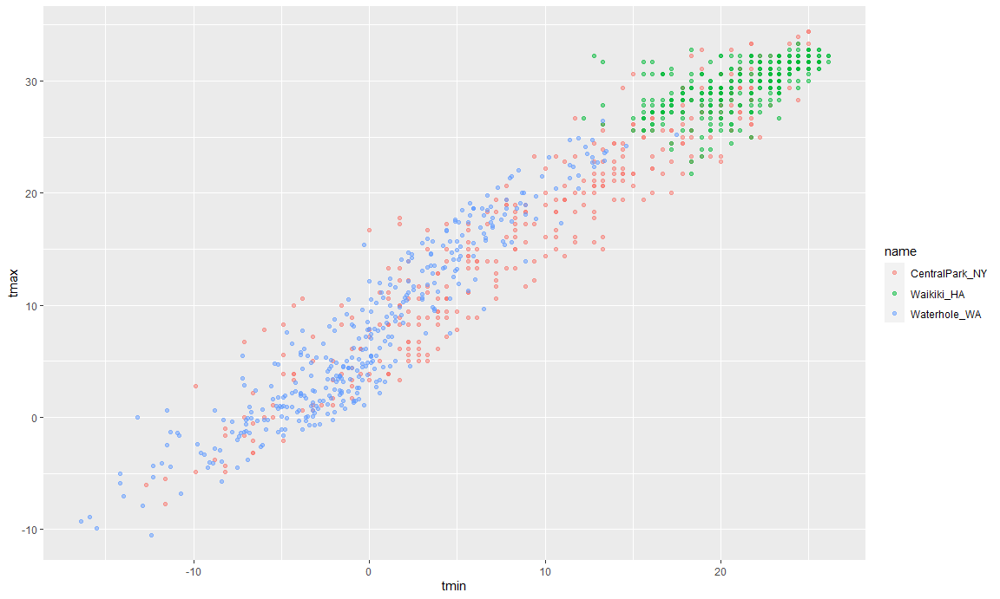

``` r
ggplot(weather_df) + geom_point(aes(x = tmax, y = tmin), color = "blue")
```

    ## Warning: Removed 15 rows containing missing values (geom_point).

<!-- -->

``` r
ggplot(weather_df) + geom_point(aes(x = tmax, y = tmin, color = "blue"))
```

    ## Warning: Removed 15 rows containing missing values (geom_point).

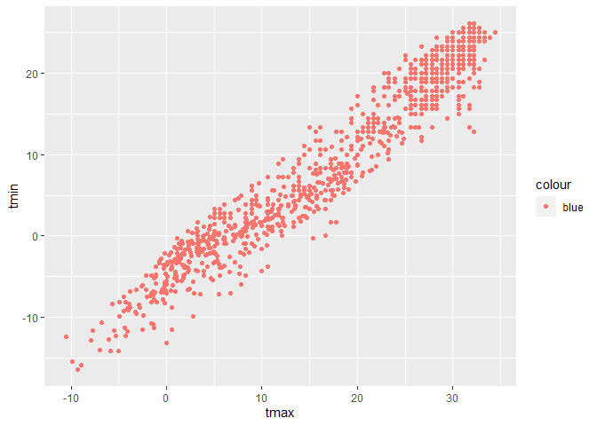<!-- -->

``` r
weather_plot <- ggplot(weather_df,aes(x = prcp))

weather_plot + geom_histogram(aes(fill = name))
```

    ## `stat_bin()` using `bins = 30`. Pick better value with `binwidth`.

    ## Warning: Removed 3 rows containing non-finite values (stat_bin).

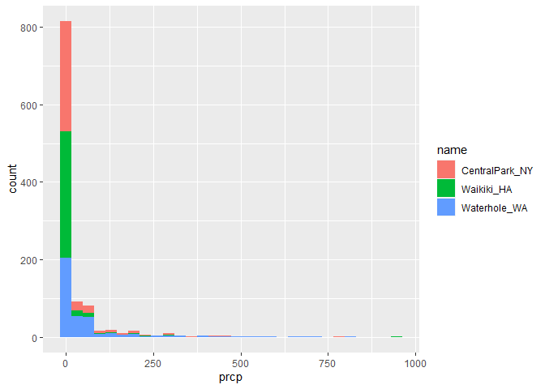<!-- -->

``` r
weather_plot + geom_density(aes(fill = name),alpha = .4)
```

    ## Warning: Removed 3 rows containing non-finite values (stat_density).

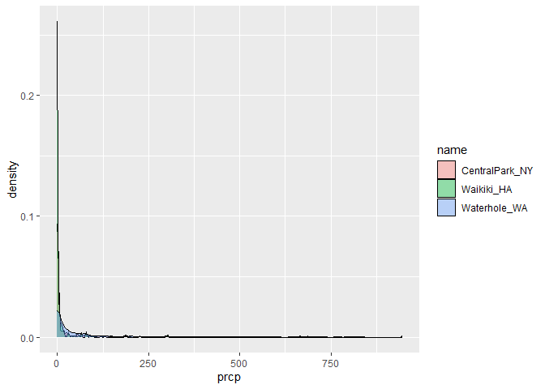<!-- -->

``` r
weather_plot + geom_boxplot(aes(x = name,y = prcp))
```

    ## Warning: Removed 3 rows containing non-finite values (stat_boxplot).

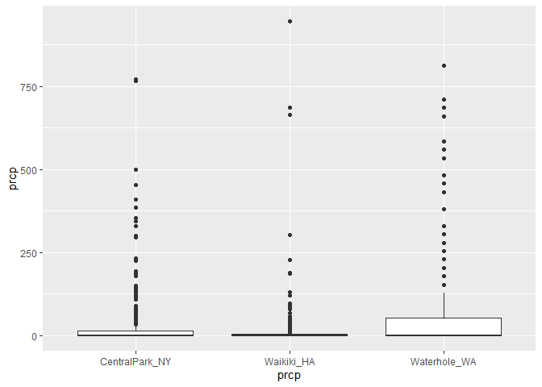<!-- -->

``` r
weather_plot + geom_violin(aes(x = name,y = prcp,fill = name),alpha = .5)
```

    ## Warning: Removed 3 rows containing non-finite values (stat_ydensity).

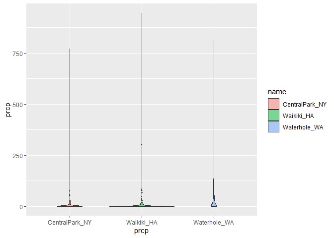<!-- -->

``` r
weather_plot + geom_density_ridges(aes(y=name),scale = .85)
```

    ## Picking joint bandwidth of 4.61

    ## Warning: Removed 3 rows containing non-finite values (stat_density_ridges).

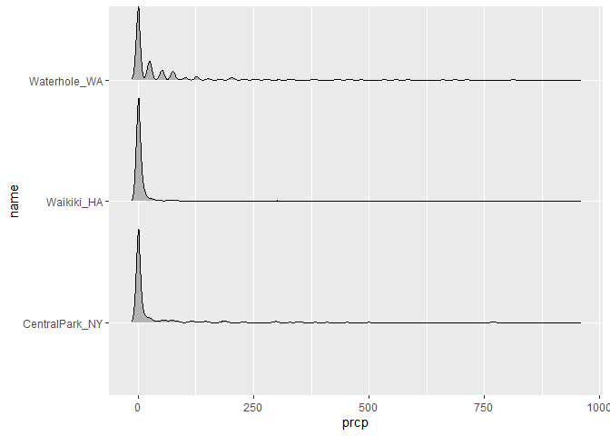<!-- -->

``` r
weather_df %>% 
  filter(prcp >0) %>% 
  ggplot(aes(x = prcp,y = name)) +
  geom_density_ridges(scale = .85)
```

    ## Picking joint bandwidth of 19.7

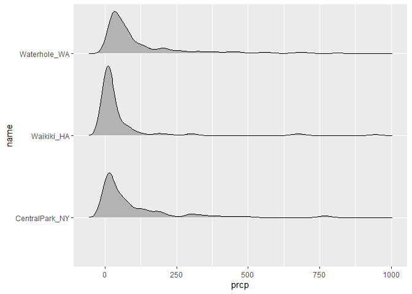<!-- -->
