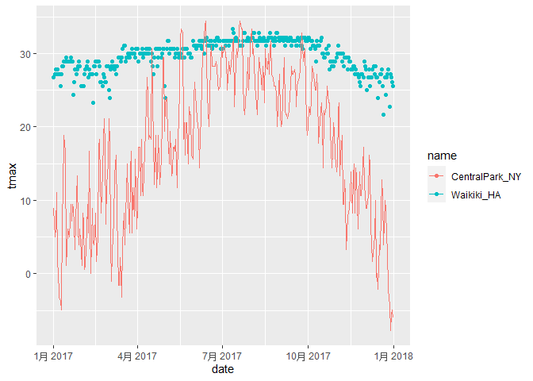

Visualization
================
Ying Jin
2020/10/1

``` r
library(tidyverse)
```

    ## -- Attaching packages ---------------------------------------------------------- tidyverse 1.3.0 --

    ## √ ggplot2 3.3.2     √ purrr   0.3.4
    ## √ tibble  3.0.3     √ dplyr   1.0.2
    ## √ tidyr   1.1.2     √ stringr 1.4.0
    ## √ readr   1.3.1     √ forcats 0.5.0

    ## -- Conflicts ------------------------------------------------------------- tidyverse_conflicts() --
    ## x dplyr::filter() masks stats::filter()
    ## x dplyr::lag()    masks stats::lag()

``` r
library(patchwork)
```

## Load the weather data

``` r
weather_df = 
  rnoaa::meteo_pull_monitors(
    c("USW00094728", "USC00519397", "USS0023B17S"),
    var = c("PRCP", "TMIN", "TMAX"), 
    date_min = "2017-01-01",
    date_max = "2017-12-31") %>%
  mutate(
    name = recode(
      id, 
      USW00094728 = "CentralPark_NY", 
      USC00519397 = "Waikiki_HA",
      USS0023B17S = "Waterhole_WA"),
    tmin = tmin / 10,
    tmax = tmax / 10) %>%
  select(name, id, everything())
```

    ## Registered S3 method overwritten by 'hoardr':
    ##   method           from
    ##   print.cache_info httr

    ## using cached file: C:\Users\jinyc\AppData\Local\cache/R/noaa_ghcnd/USW00094728.dly

    ## date created (size, mb): 2020-10-01 23:25:20 (7.534)

    ## file min/max dates: 1869-01-01 / 2020-09-30

    ## using cached file: C:\Users\jinyc\AppData\Local\cache/R/noaa_ghcnd/USC00519397.dly

    ## date created (size, mb): 2020-10-01 23:28:19 (1.703)

    ## file min/max dates: 1965-01-01 / 2020-03-31

    ## using cached file: C:\Users\jinyc\AppData\Local\cache/R/noaa_ghcnd/USS0023B17S.dly

    ## date created (size, mb): 2020-10-01 22:54:34 (0.879)

    ## file min/max dates: 1999-09-01 / 2020-09-30

## Remember this plot…?

``` r
weather_df %>% 
  ggplot(aes(x = tmin,y=tmax,color = name)) +
  geom_point()
```

    ## Warning: Removed 15 rows containing missing values (geom_point).

<!-- -->

## Label

``` r
weather_df %>% 
  ggplot(aes(x = tmin,y=tmax,color = name)) +
  geom_point(alpha = .5)+
  labs(
    title="Temperature plot",
    x = "Minimum daily temperature (C)",
    y = "Maximum daily temperature (C)",
    caption = "Data from the rnoaa package,temperature in 2017"
  )
```

    ## Warning: Removed 15 rows containing missing values (geom_point).

<!-- -->

# Scales

Start with the same plot; x and y scales

``` r
weather_df %>% 
  ggplot(aes(x = tmin,y=tmax,color = name)) +
  geom_point(alpha = .5)+
  labs(
    title="Temperature plot",
    x = "Minimum daily temperature (C)",
    y = "Maximum daily temperature (C)",
    caption = "Data from the rnoaa package,temperature in 2017"
  ) +
  scale_x_continuous(
    breaks = c(-15,0,15),
    labels = c("-15 C","0","15 C")
  ) +
  scale_y_continuous(
    position = "right"
  )
```

    ## Warning: Removed 15 rows containing missing values (geom_point).

<!-- -->

Look at color scales

``` r
weather_df %>% 
  ggplot(aes(x = tmin,y=tmax,color = name)) +
  geom_point(alpha = .5)+
  labs(
    title="Temperature plot",
    x = "Minimum daily temperature (C)",
    y = "Maximum daily temperature (C)",
    caption = "Data from the rnoaa package,temperature in 2017"
  )+
  scale_color_hue(
    name = "Location",
    h = c(100,300))
```

    ## Warning: Removed 15 rows containing missing values (geom_point).

<!-- -->

Another way to modify color scale

``` r
weather_df %>% 
  ggplot(aes(x = tmin,y=tmax,color = name)) +
  geom_point(alpha = .5)+
  labs(
    title="Temperature plot",
    x = "Minimum daily temperature (C)",
    y = "Maximum daily temperature (C)",
    caption = "Data from the rnoaa package,temperature in 2017"
  ) +
  viridis::scale_color_viridis(
    name = "Loctation",
    discrete = TRUE
  )
```

    ## Warning: Removed 15 rows containing missing values (geom_point).

<!-- -->

## Themes

Shift the legend.

``` r
weather_df %>% 
  ggplot(aes(x = tmin,y=tmax,color = name)) +
  geom_point(alpha = .5)+
  labs(
    title="Temperature plot",
    x = "Minimum daily temperature (C)",
    y = "Maximum daily temperature (C)",
    caption = "Data from the rnoaa package,temperature in 2017"
  ) +
  viridis::scale_color_viridis(
    name = "Loctation",
    discrete = TRUE
  ) +
  theme(legend.position = "bottom")
```

    ## Warning: Removed 15 rows containing missing values (geom_point).

<!-- -->

Change the overall theme.

``` r
weather_df %>% 
  ggplot(aes(x = tmin,y=tmax,color = name)) +
  geom_point(alpha = .5)+
  labs(
    title="Temperature plot",
    x = "Minimum daily temperature (C)",
    y = "Maximum daily temperature (C)",
    caption = "Data from the rnoaa package,temperature in 2017"
  ) +
  viridis::scale_color_viridis(
    name = "Loctation",
    discrete = TRUE
  ) +
  theme_minimal() +
  theme(legend.position = "bottom")
```

    ## Warning: Removed 15 rows containing missing values (geom_point).

<!-- -->

theme\_minimal is recommened, but there are other themes.

``` r
weather_df %>% 
  ggplot(aes(x = tmin,y=tmax,color = name)) +
  geom_point(alpha = .5)+
  labs(
    title="Temperature plot",
    x = "Minimum daily temperature (C)",
    y = "Maximum daily temperature (C)",
    caption = "Data from the rnoaa package,temperature in 2017"
  ) +
  viridis::scale_color_viridis(
    name = "Loctation",
    discrete = TRUE
  ) +
  ggthemes::theme_economist()
```

    ## Warning: Removed 15 rows containing missing values (geom_point).

<!-- -->

## Settng options

``` r
library(tidyverse)

knitr::opts_chunk$set(
  fig.width = 6,
  fig.asp = .6,
  out.width = "90%"
)

theme_set(theme_minimal() + theme(legend.position = "bottom"))

options(
  ggplot2.continuous.colour = "viridis",
  ggplot_cpntinuous.fill = "viridis"
)

scale_colour_discrete = scale_color_viris_d
scale_fill_discrete = scale_fill_viridis_d
```

## Data args in ‘geom’

``` r
central_park = 
  weather_df %>% 
  filter(name == "CentralPark_NY")

waikiki =
  weather_df %>% 
  filter(name == "Waikiki_HA")

ggplot(data = waikiki,aes(x=date,y=tmax,color = name))+
  geom_point()+
  geom_line(data = central_park)
```

    ## Warning: Removed 3 rows containing missing values (geom_point).

<!-- -->

## ‘patchwork’

remember facetgrid?

``` r
weather_df %>% 
  ggplot(aes(x = tmin,fill = name)) +
  geom_density(alpha = .5) +
  facet_grid(.~name)
```

    ## Warning: Removed 15 rows containing non-finite values (stat_density).

<!-- -->

what happens when you want multipanel plots but can’t facet…?

``` r
tmax_tmin_plot = 
  weather_df %>% 
  ggplot(aes(x = tmin, y=tmax,color = name)) +
  geom_point(alpha = .5)+
  theme(legend.position = "none")

prcp_dens_plot = 
  weather_df %>% 
  filter(prcp > 0) %>% 
  ggplot(aes(x = prcp,fill=name))+
  geom_density(alpha = .5)+
  theme(legend.position = "none")

tmax_date_plot = 
  weather_df %>% 
  ggplot(aes(x = date,y=tmax,color = name))+
  geom_point()+
  geom_smooth(se = FALSE)+
  theme(legend.position = "none")

(tmax_tmin_plot + prcp_dens_plot) / tmax_date_plot
```

    ## Warning: Removed 15 rows containing missing values (geom_point).

    ## `geom_smooth()` using method = 'loess' and formula 'y ~ x'

    ## Warning: Removed 3 rows containing non-finite values (stat_smooth).

    ## Warning: Removed 3 rows containing missing values (geom_point).

<!-- -->

## Data manipulation

Control your factors

``` r
weather_df %>% 
  mutate(
    name = factor(name),
    name  = forcats::fct_relevel(name,c("Waikiki_HA"))
  ) %>% 
  ggplot(aes(y = tmax,x = name,fill = name)) +
  geom_violin(alpha = .5)
```

    ## Warning: Removed 3 rows containing non-finite values (stat_ydensity).

<!-- -->

what if i want densities for tmin and tmax simultaneously?

``` r
weather_df %>% 
  pivot_longer(
    tmax:tmin,
    names_to = "observations",
    values_to = "temperatures"
  ) %>% 
  ggplot(aes(x = temperatures,fill = observations))+
  geom_density(alpha = .5)+
  facet_grid(.~name)
```

    ## Warning: Removed 18 rows containing non-finite values (stat_density).

<!-- -->

## Revisit the pups

Data form the FAS study

``` r
pups_data <- read_csv("./data/FAS_pups.csv") %>% 
  janitor::clean_names() %>% 
  mutate(sex = recode(sex,`1` = "male",`2` = "female"))
```

    ## Parsed with column specification:
    ## cols(
    ##   `Litter Number` = col_character(),
    ##   Sex = col_double(),
    ##   `PD ears` = col_double(),
    ##   `PD eyes` = col_double(),
    ##   `PD pivot` = col_double(),
    ##   `PD walk` = col_double()
    ## )

    ## Warning in FUN(X[[i]], ...): strings not representable in native encoding will
    ## be translated to UTF-8

    ## Warning in FUN(X[[i]], ...): unable to translate '<U+00C4>' to native encoding

    ## Warning in FUN(X[[i]], ...): unable to translate '<U+00D6>' to native encoding

    ## Warning in FUN(X[[i]], ...): unable to translate '<U+00E4>' to native encoding

    ## Warning in FUN(X[[i]], ...): unable to translate '<U+00F6>' to native encoding

    ## Warning in FUN(X[[i]], ...): unable to translate '<U+00DF>' to native encoding

    ## Warning in FUN(X[[i]], ...): unable to translate '<U+00C6>' to native encoding

    ## Warning in FUN(X[[i]], ...): unable to translate '<U+00E6>' to native encoding

    ## Warning in FUN(X[[i]], ...): unable to translate '<U+00D8>' to native encoding

    ## Warning in FUN(X[[i]], ...): unable to translate '<U+00F8>' to native encoding

    ## Warning in FUN(X[[i]], ...): unable to translate '<U+00C5>' to native encoding

    ## Warning in FUN(X[[i]], ...): unable to translate '<U+00E5>' to native encoding

``` r
litters_data <- read_csv("./data/FAS_litters.csv") %>% 
  janitor::clean_names() %>% 
  separate(group,into = c("does","day_of_tx"),sep=3)
```

    ## Parsed with column specification:
    ## cols(
    ##   Group = col_character(),
    ##   `Litter Number` = col_character(),
    ##   `GD0 weight` = col_double(),
    ##   `GD18 weight` = col_double(),
    ##   `GD of Birth` = col_double(),
    ##   `Pups born alive` = col_double(),
    ##   `Pups dead @ birth` = col_double(),
    ##   `Pups survive` = col_double()
    ## )

``` r
fas_data =  left_join(pups_data,litters_data,by = "litter_number")


fas_data %>% 
  select(does,day_of_tx,starts_with("pd_")) %>% 
  pivot_longer(pd_ears:pd_walk,
               names_to = "outcome",
               values_to = "pn_day") %>% 
  drop_na() %>% 
  mutate(outcome = forcats::fct_reorder(outcome,pn_day,median)) %>% 
  ggplot(aes(x = does,y = pn_day))+
  geom_violin() +
  facet_grid(day_of_tx~outcome)
```

<!-- -->

## Practice

``` r
weather_df %>% 
  ggplot(aes(x = date, y = tmax,color = name)) +
  geom_point(aes(size = prcp),alpha = .4) +
  geom_smooth(se = FALSE) +
  viridis::scale_color_viridis(discrete = TRUE) +
  labs(
    title = "Tempreture Plot",
    x = "Date",
    y = "Maximum Temperature (C)",
    caption = "Data from the ronaa package"
  ) +
  theme_minimal() +
  theme(legend.position = "bottom")
```

    ## `geom_smooth()` using method = 'loess' and formula 'y ~ x'

    ## Warning: Removed 3 rows containing non-finite values (stat_smooth).

    ## Warning: Removed 3 rows containing missing values (geom_point).

<!-- -->
